# Scratch

1 hour

Scratch is a **visual programming language** that you can use to make simple programs and games. It's
aimed primarily at children but anyone can use it to get started with programming.

There are versions you can download to your machine or you can get started really quickly using the website.

Go to: [http://scratch.mit.edu](http://scratch.mit.edu)

and click on the *Create* button

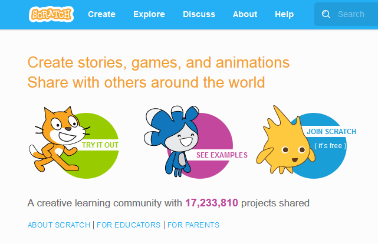

The left hand side is where your program will run. The middle is set of **building blocks** you can use to
build the program (Scripts). Right hand side is where you drag the blocks and wire them up.

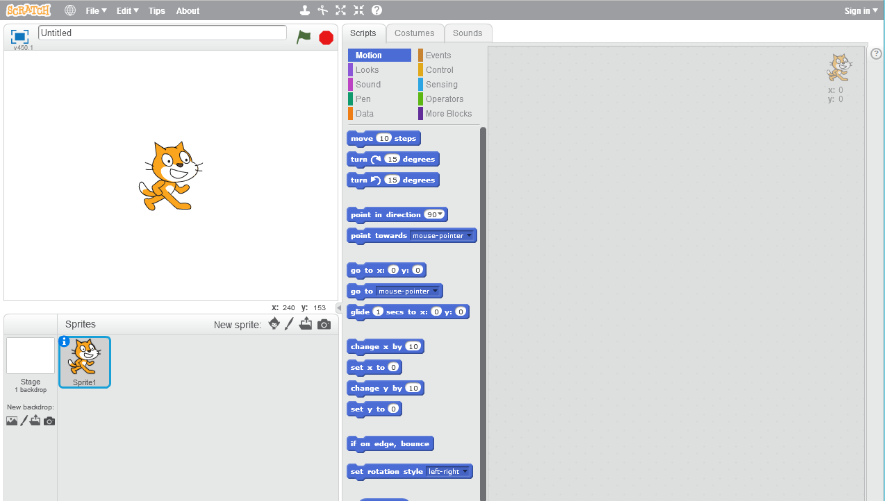

Note the Start and Stop buttons at the top.

## The Worst Game in History

I feel quite proud that I have managed to devise the **worst game in the history** of computer games and because I am so proud, I would like to share it with you and have you build it with me.

## The Pitch

I want to write a game where the scratch cat plays with the mouse (puns!). The cat scores points for catching the mouse and if it scores enough points, the game is over. Pretty exiting huh?

## Building the Game

### Make the cat walk

From the **Movement** tab, drag a **move** block across to the right hand side and click on it with your mouse.

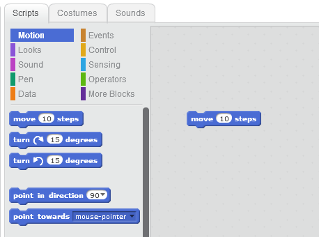

You should see the cat move a little bit. Experiment with **changing the value** in the box. What happens?
What happens when you enter a negative value? Is that what you thought it would do?

### Really make it walk

Switch to the **Control** section and drag a **repeat** block.

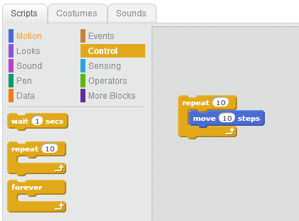

Slide move into the repeat block, notice how **blocks light up** as you move them together. Click on
the assembled blocks. What happens? Change the repeat value.

The repeat block surrounds the other block, implying that whenever that runs, the things inside it will run.

Let's make it walk all the way across the screen. Change **repeat** to a **forever** loop.
Pull movement block out and drag repeat block out. Drag on the forever loop.

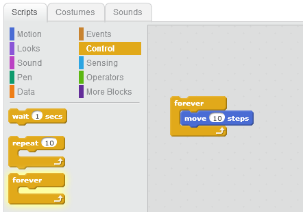

Notice when you have a block of blocks, you have to disassemble them from the bottom can't get rid of the top block on it's own!

Click on block - will go off screen and you can drag it back on but it will keep trying
to escape!!!

Lets try to correct that. Go to motion blocks and use if on edge, bounce.

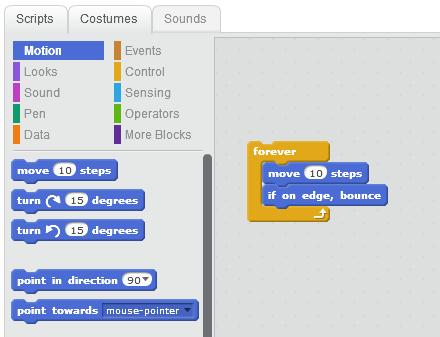

Now it's upside down!

Look at bottom of page and right click on cat sprite.

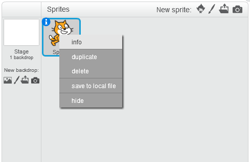

Go to info on sprite and change rotation symbol to left right.

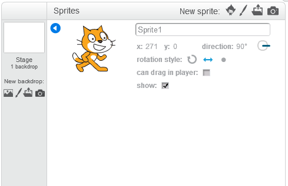

### Rubbish

Now that it's behaving like we want let's try and make it more realistic. For a cartoon cat.

**Sprites** have a visual property called their **costume**. This is a range of images they display at any one time. You can add to them if you want.

Our cat is showing a single costume at the moment. We can simulate animation by switching between two different costumes with a small delay in between each change.

Switch to **Looks** and drag on a **costume** block.

Switch to Costume 1
Move 10
Wait 0.25
Switch costume 2
Move 10
Wait 0.25

It's running very quickly now. How do we slow it down? Add a wait block.

Is there a better way - algorithm works but is a better way?  Use **Next Costume** and remove other blocks

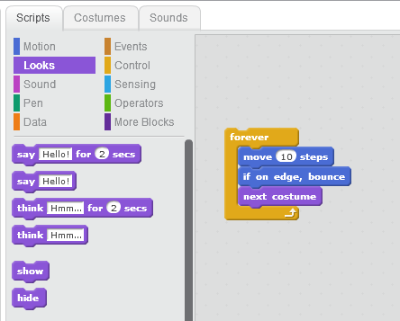

This will cycle through all the costumes the cat has available. Looks better? What about the wait, we can make that zero?

### Events

Clicking on the blocks to get the cat to do something is all very well but it's not what we want to see in the finished game. We want the cat to start running as soon as the game starts.

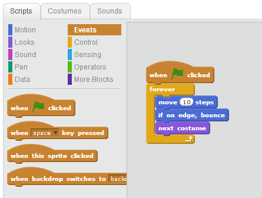

Switch to **Events** and drag on a **When Start** and plug it into the top of the list of blocks.

### Game

Now we've got the mouse moving, let's try making it more like a proper (if really bad) game.

Let's try keeping the mouse moving and if the cat catches up with you, it scores a point!

Add **point towards mouse pointer** at end of blocks.

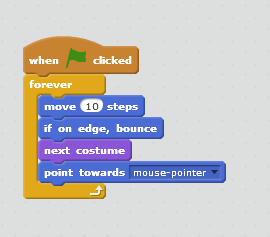

So now the cat, follows you around the screen.

### Here's the Catch

How does it catch you? We need to **test** where mouse pointer and cat are and do something if they are in the same place.

In **sensing**, there is a **touching** block. Drag the touching block onto our program. Notice it's a different shape and doesn't seem to fit with anything else. We need somewhere for it to go. Luckily there is somewhere for it to go. That is an if block. **If** s live in the **control** area.

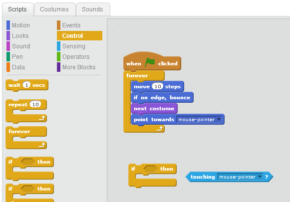

Add If block (from control) and slot in the touching. Hinting that it will do something inside it when the
sprite is touching mouse pointer? But what?

### Keeping Score

Make Variable from data. Score for this sprite only.

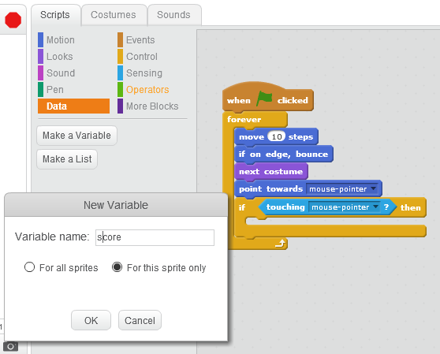

Initialise at beginning before the game starts. If touching, change score by 1.

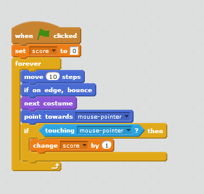

### Let's end this:

Bit too easy for cat, when score increases, move cat away again. Go to random position.

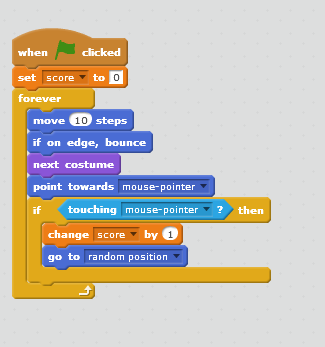

Now, what about if we get to a big value?

Let's put in a check to say we will end the game when we get to 50? If operators
comparison. Add MaxScore variable. Set it to 50 at start. If Score > MaxScore then end.
Stop this script.

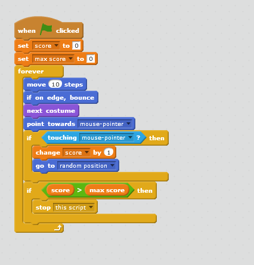

How could we make the game ending better? You win?

### Turtles

Use *Pens* to draw pretty pictures and teach maths - angles, distances, properties of figures etc., moving relative points

### Squares

Start by changing the sprite to something else.

Next drag a **set pen colour** block on.

Add **pen down**

Add **go to** and set **random position**

Add **move x steps** and change the value

Add **turn x degrees** and set to 90

Keep adding blocks to draw a square.

Can we change it to make it shorter and easier to read?

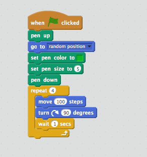

What else can we make, rotation and repeating patterns, drawing a house, drawing circles, changing colours, pen widths.

### Community

One of the best things about scratch is that it all projects on the site have two modes. One to run the game, but you can look at the internals (not something you can ordinarily do) and copy the project and adapt it yourself. Scratch is setup to support community and sharing.

### Robot Finds Kitten

Before we leave scratch, I'd like to share with you another one of my awful games.

This is a more complete game, I wrote a game with my oldest son a long time ago, based on an internet meme. Robot Finds Kitten which is available for x-box and playstation and lots of other platforms. The game uses terrible graphics and background colours by design and is meant to be among the most pointless available. You can play the game and look at the structure of the game here:

https://scratch.mit.edu/projects/118819/

### What Have We Learned?

Decomposing a problem into smaller parts.
Putting things in the right order - sequence
Selection - is it on an edge, is the game over?
Repetition - forever blocks
Variables - score, location, speed, colour
Events - program start, end, mouse click, mouse move.

### Resources

Raspberry Pi website has lots of good scratch material that is not RP specific.

https://www.raspberrypi.org/learning/getting-started-with-scratch/
