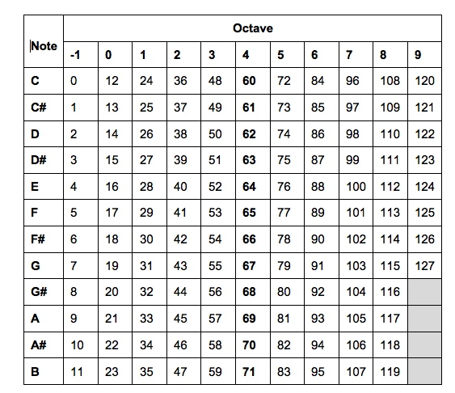
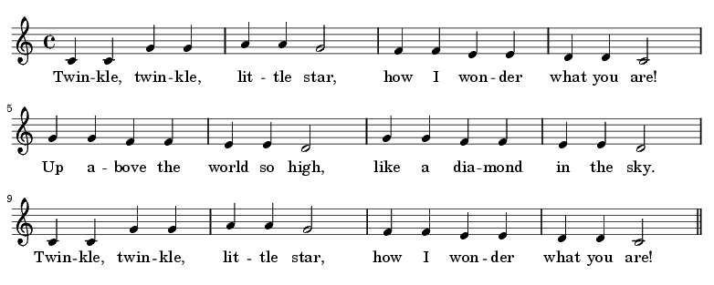
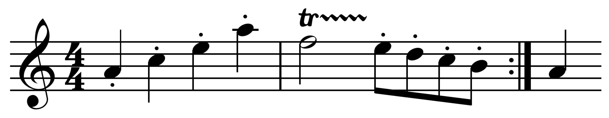

# Sonic Pi

Sonic Pi

Sam Aaron

Easy first step into "real" programming

## First Program

~~~

play 60

~~~

Our first program, plays a note and then stops. Not very exciting but we have written some text, had the computer read it, understand it and decide what to do with it.

We can change the value 0 - 255 and see what changes about the sound we hear. So we can see that the number represents a pitch or a musical note.

## Second Program

Another way to represent pitches is using names of notes. There's a special notation for this. 48 maps to the note C and it's in the third octave, so we say it's C3. Like this:

~~~

play :C4

~~~

Make sure you have a colon in there as well. That's just to tell the computer that the next thing is something it should recognize as a special thing.

## Rests

Music is about more than notes, it's also about the gaps between notes. Type this

~~~

play :C4
sleep 1
play :C4
sleep 1

~~~

What does the 1 represent. It's not a note value now, we are using a number to represent a time interval. What happens when you increase or decrease the time? Use 10 or try 0.25

## Simple Tunes

Not very exciting is it? How about if we add some more notes?

~~~

play :C4
sleep 1
play :C4
sleep 1
play :G4
sleep 1
play :G4
sleep 1
play :A4
sleep 1
play :A4
sleep 1
play :G4
sleep 2

~~~

Notice the last note is longer than the others because we have given the note twice the length of the others.

Anybody guess what the tune is?

## And Complete It

Can you complete the tune? Or add more to it? Maybe work in pairs.

## Tidying up

This code is starting to get a bit unwieldy, it could do with some tidying up. How about we change twinkle twinkle to make it a bit nicer.

We can set up our timing so that we only need to change the time values in one place.

~~~

root = 60
quarter_note = 1
half_note = quarter_note * 2

~~~

We can also notice that we are repeating notes so we can do something like:

~~~

2.times do
  play root
  sleep quarter_note
end

2.times do
  play root + 7
  sleep quarter_note
end

2.times do
  play root + 9
  sleep quarter_note

play root + 7
sleep half_note

~~~

We have cut down the notes almost in half. If we need to change something, we have chunks that are easier to reason about.

or we could use:

play_timed and give it a list of notes with delays between them.

~~~

play_pattern_timed [ :C4, :C4, :G4, :G4, :A4, :A4, :G4 ], [ 1, 1, 1, 1, 1, 1, 2 ]

~~~

## Play a Scale

Intervals and maths

## Halloween Challenge

In honour of halloween, you can do all sorts of music. Here's a quick version of the "villain" trope from the silent movies but you might recognize from cartoons.

~~~

use_synth :piano

speed = 0.65  #set overall speed

minim = 2 * speed
crotchet = 1 * speed
quaver = 0.5 * speed

2.times do
  play_pattern_timed [:A3, :C4, :E4, :A4], crotchet
  play :F4
  sleep minim
  play_pattern_timed [:E4, :D4, :C4, :B3 ], quaver
end

play :A3
sleep crotchet

~~~

## Frozen

If you really get into composition this way, there's lots you can do. Here's a version of the Disney song "Let it Go" from the film "Frozen"

## Loops

## Live Playing

## Random Choice

## Adding Interest

## Synths
